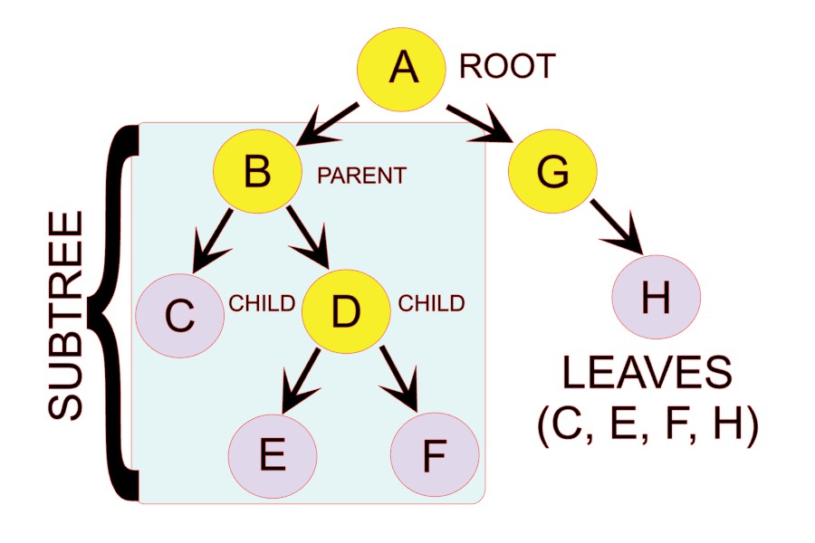
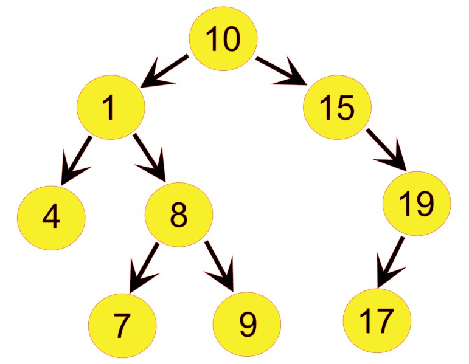
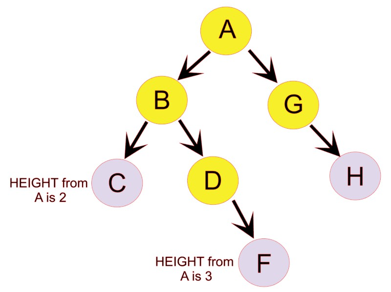
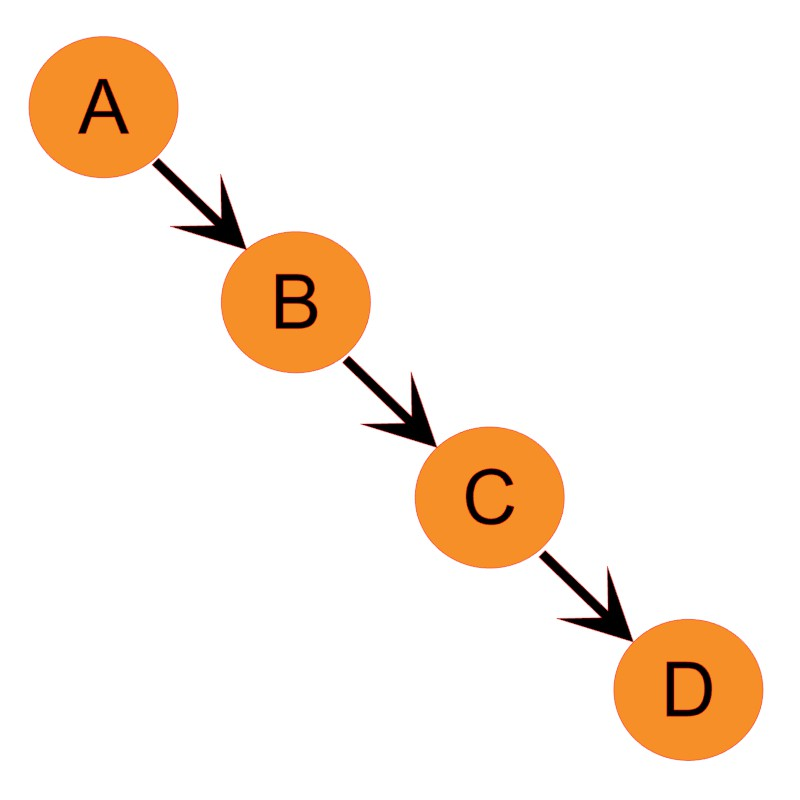

# TREE

A `tree` is a hierarchial data structure that consists on nodes connected by edges. 
The top node is called the root node. Nodes that connect to no other node are called leaf nodes. Parent nodes have nodes connected to it. The nodes to the left and right of any parent node are child nodes. Each node can have zero or more child nodes. There is always only one root node. 


Breakdown of Binary Tree

## Types of Trees
`Binary tree`: This is a tree that links to no more than two other nodes. 

`Binary Search Tree` (BST): this is a node-based binary tree. The way the BST works is that the left subtree of a node only contains nodes with keys that are lesser than the node's key. The right subtree of the node only contains nodes with keys that are greater than the node's key. There are also no duplicate nodes (unless allowed). By using this process, the data stored is sorted. If there is a dynamic array or linked list containing sorted values, the Big O Notation is O(n). 


Binary Search Tree

`Balanced Binary Search Tree` (Balanced BST): 
This type of tree is such that the difference in height between any two subtrees is not dramatically different.
Big O Notation for Balanced BST is O(log n) because of the ability to split the job in half recursively. An AVL tree is a self-balancing binary search tree. In an AVL tree, the difference between the height of the left subtree and right subtree must be less than 2. 

Balanced BST

`Unbalanced BST`
This tree ends up looking more like a linked list and results in O(n). 

Unbalanced BST

## BST Operations

**Initiate Tree**
```python
class Node:
   def __init__(self, data):
      self.left = None
      self.right = None
      self.data = data
```

**Inserting into a BST**
In the above example of initiating a tree, use the following  after def __init__(self, data).
```python
def insert(self, data):
    # Compare the new value with the parent node
      if self.data:
         if data < self.data:
            if self.left is None:
               self.left = Node(data)
            else:
               self.left.insert(data)
         elif data > self.data:
               if self.right is None:
                  self.right = Node(data)
               else:
                  self.right.insert(data)
      else:
         self.data = data
# Print the tree
def print_tree(self):
      if self.left:
         self.left.print_tree()
      print( self.data),
      if self.right:
         self.right.print_tree()

root = Node(15)
root.insert(5)
root.insert(12)
root.insert(2)
root.insert(10)
root.print_tree()

#Output: 2 5 10 12 15
```

**Find Height of Tree**

```python
def height(node):
    if node is None:
        return 0
 
    else:
        left_height = height(node.left)
        right_height = height(node.right)
 
        # Return larger height
        if (left_height > right_height):
            return left_height + 1 
        else:
            return right_height + 1

root = Node(50)
root.insert(15)
root.insert(35)
root.insert(10)
root.insert(40)
root.insert(5)
root.insert(25)
print(f'Height of tree is {height(root)}')
 
# Output: Height of tree is 4
```

## **Traversing a Tree**
### In Order Traversal
Left subtree is visited first, then root, and finally the right subtree. 
Add this after def print_tree(self)
```python
# Left -> Root -> Right
   def inorder_traversal(self, root):
      traverse = []
      if root:
         traverse = self.inorder_traversal(root.left)
         traverse.append(root.data)
         traverse = traverse + self.inorder_traversal(root.right)
      return traverse

root = Node(50)
root.insert(15)
root.insert(35)
root.insert(10)
root.insert(40)
root.insert(5)
root.insert(25)
print(root.inorder_traversal(root))  

# Output: [5, 10, 15, 25, 35, 40, 50]
```

### Pre-Order Traversal
The root node is visited first, then the left subtree, and finally the right subtree. 
```python
# Root -> Left -> Right
   def preorder_traversal(self, root):
      traverse = []
      if root:
         traverse.append(root.data)
         traverse = traverse + self.preorder_traversal(root.left)
         traverse = traverse + self.preorder_traversal(root.right)
      return traverse
root = Node(50)
root.insert(15)
root.insert(35)
root.insert(10)
root.insert(40)
root.insert(5)
root.insert(25)
print(root.preorder_traversal(root))

# Output: [50, 15, 10, 5, 35, 25, 40]
```

### Post-Order Traversal
The left subtree is visited first, following by the right subtree, and finally the root node.
```python
# Left -> Right -> Root
    def postorder_traversal(self, root):
        traverse = []
        if root:
            traverse = self.postorder_traversal(root.left)
            traverse = traverse + self.postorder_traversal(root.right)
            traverse.append(root.data)
        return traverse
root = Node(50)
root.insert(15)
root.insert(35)
root.insert(10)
root.insert(40)
root.insert(5)
root.insert(25)
print(root.postorder_traversal(root))

# Output: [5, 10, 25, 40, 35, 15, 50]
```


## Example
Finding the sum of all nodes.
```python
class Node:
    def __init__(self, data):
        self.left = None
        self.right = None
        self.data = data

    def insert(self, data):
    # Compare the new value with the parent node
        if self.data:
            if data < self.data:
                if self.left is None:
                    self.left = Node(data)
                else:
                    self.left.insert(data)
            elif data > self.data:
                if self.right is None:
                    self.right = Node(data)
                else:
                    self.right.insert(data)
        else:
            self.data = data

    # Finding the values in each subtree
    def find_sum(self, Node):
        if Node is None:
            return 0
        return Node.data + self.find_sum(Node.left) + self.find_sum(Node.right)

root = Node(50)
root.insert(15)
root.insert(35)
root.insert(10)
root.insert(40)
root.insert(5)
root.insert(25)
print(root.find_sum(root))

# Output: 180
```


## Problem to Solve
Code `def find_value` to find if a specific value is in a subtree. After the inserting all of the nodes, write code to find if 40 and 75 is in the subtrees in separate print statements.
```python
class Node:
    def __init__(self, data):
        self.left = None
        self.right = None
        self.data = data

    def insert(self, data):
        # Compare the new value with the parent node
        if self.data:
            if data < self.data:
                if self.left is None:
                    self.left = Node(data)
                else:
                    self.left.insert(data)
            elif data > self.data:
                if self.right is None:
                    self.right = Node(data)
                else:
                    self.right.insert(data)
        else:
            self.data = data

    # Finding a specific value in the tree
    def find_value(self, value):
        pass

root = Node(50)
root.insert(15)
root.insert(35)
root.insert(10)
root.insert(40)
root.insert(5)
root.insert(25)

```


[Tree Solution](https://github.com/Dynara/cse212_tutorial_project/blob/main/TREE/tree_problem_SOLVED.py) | [Home](https://github.com/Dynara/cse212_tutorial_project/blob/ef7739d0986b2bde2646447b9130fa3171debfec/README.md) | [SET](https://github.com/Dynara/cse212_tutorial_project/blob/22501e85cdc7cff803caf8595d4c676d2a4e4a7b/SET/SET.md) | [STACK](https://github.com/Dynara/cse212_tutorial_project/blob/main/STACK/STACK.md)